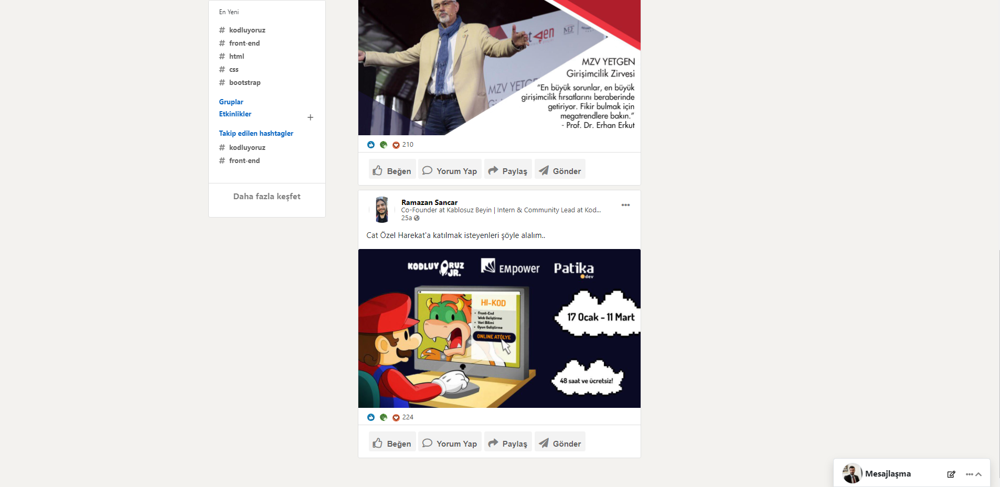

# Linkedin Clonlama 

Bu eğitimimizde Linkedin'u cloneluyoruz

[LinkedIn](linked.in) Clone dersimiz oldukca zor olup zevkli bir çalışma oldu.





```javaScript
console.log('Hello World');
```

# Contributing
Pull requestler kabul edilir. Büyük değişiklikler için, lütfen önce neyi değiştirmek istediğinizi tartışmak için konu açınız.

# Licence

[MIT](https://choosealicense.com/licenses/mit)

## Teşekkürler.
