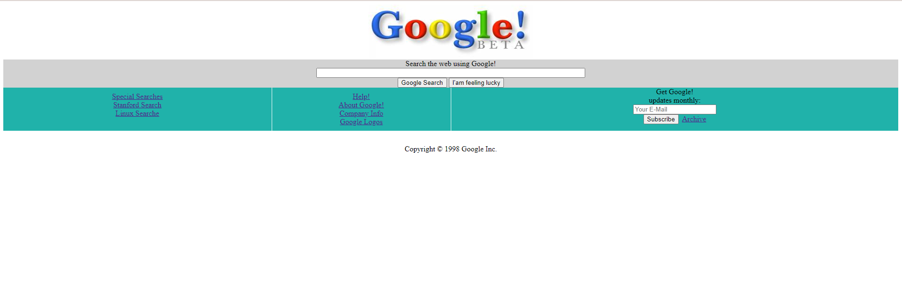

# kodluyoruz-odev-part2

Kodluyoruz Eğitimi kapsamında açtığım ilk repo

İçerisinde bir ader index.html, style.css ve Readme dosyalarını barındırmaktadır.



# Installation 
 Öncelikle bu projeyi clonelayın.
 ```c
https://github.com/Gunesix/kodluyoruz-odev-part2/tree/main/google1998
 ```

 # Usage
 Projeyi cloneladıktan sonra Visual Studio Code programında açınız.


```javaScript
console.log('Hello World');
```

# Contributing
Pull requestler kabul edilir. Büyük değişiklikler için, lütfen önce neyi değiştirmek istediğinizi tartışmak için konu açınız.

# Licence

[MIT](https://choosealicense.com/licenses/mit)

## Teşekkürler.
